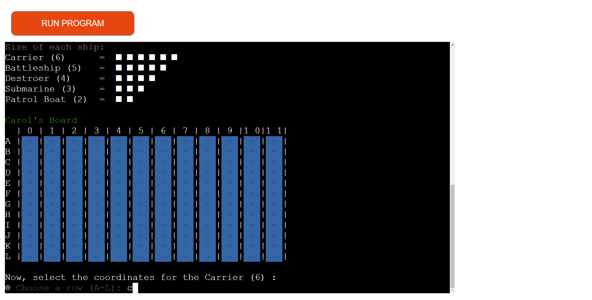

**
Be one of our sailors
**

[Your battle starts here.](https://coffee---shop.herokuapp.com/)

## How to play

### Ships Sizes
- Carrier = 6 * ■
- Battleship = 5 * ■
- Destroyer = 4 * ■
- Submarine = 3 * ■
- Patrol Boat = 2 * ■

1. Enter your name.
   

   
2. Choose a row between A and L.
   - ⚠️ Choose where your ship will start to be written.
   

   
3. Choose a column between 0 and 11.
   - ⚠️ Choose where your ship will start to be written.
   

   
4. Choose the row and column where your ship will end up.

How that must look like:

5. After choosing the coordinates of your ship, choose the coordinates where you want to drop the bomb on the PC map.

6. Soon the game will show you if what you hit was a ship or water, the same goes for the PC.

7. After one of the players knocks down all of his opponent's ships, the game will show if you win ou lost the battle.

### Frameworks Libraries and Programs

1. [Github](https://github.com/)
    - Github was used to create and store the project repository.
1. [PyCharm Community](https://www.jetbrains.com/pycharm/)
    - PyCharm Community was used to create my files and code the project.
1. [Am I responsive](http://ami.responsivedesign.is/)
    - Am I responsive was used to taking screenshots of the page at different screen sizes.
1. [Heroku](https://signup.heroku.com/)
    - Heroku was used to deploy the website.
1. [Git](https://git-scm.com/)
    - Git was used for version control by utilizing the Gitpod terminal to commit to Git and Push to Heroku.
1. [Manytools](https://manytools.org/hacker-tools/ascii-banner/)
    - Manytools used to create ASCII text banners.
    
## Changes

1. In the beginning the board was written in an extensive form, very long, as: V1=[' ~',' ~',' ~',' ~',' ~',' ~',' ~',' ~' ,' ~',' ~',' ~',' ~'] , this was written 12 times and the code did not work as it should if I put for example:  V1=[' ~'* 12]* 12 or V1=[' ~',' ~',' ~',' ~',' ~',' ~',' ~',' ~' ,' ~',' ~',' ~',' ~' ] * 12 , because the language interprets this as being the same element, the ' ~' should be considered as an individual element, but after some trial and error I was able to change it to:  V1=[] for i in range(12):  V1.append([' ~'] * 12)
 - And in case it wasn't very clear, the spaces at the beginning of the '~' are just to give it a better appearance and to be able to color the background of one of the ' ~' to red replacing it with 'X' when both players throw the bomb and manage to hit a part of the ship.

## Bugs
- The code detects if the user puts a number in place of a letter, a letter that is not among the these options in the table or if the user wrote more than one letter, such as: ☻ Choose a row (A-L): 1 ☻ Choose a row (A-L): aa ☻ Choose a row (A-L): s ☻ Choose a row (A-L): # although, the code does not know if the user has entered the coordinates where there was already a bank in that exact location where the user had already chosen to place another boat.
- The code also doesn't detect if the user put the right size of the boat in the table, for example:  If the ship were the Carrier, it would have to occupy 6 spaces in the table: ■ ■ ■ ■ ■ ■  or ■ ■ ■ ■ ■ ■ and if the user entered a boat size other than 6 * ■, the code would not would detect and the entire game was compromised, without even giving the user a chance to rewrite the coordinate without resetting the game.
- The program does not have artificial intelligence in case it hits an '■' and keeps trying in the same area until it finishes destroying the entire ship for example. It may happen that the program may reach the same place where it had already reached before. So it makes him a practically irrelevant opponent, being almost impossible for it to beat the user.

## Testing
I have manually tested this project on:

- [PEP8 online](http://pep8online.com/)

## Credits

- [Logo](https://www.pngaaa.com/detail/318142)
- [Deployment](https://github.com/Code-Institute-Org/python-essentials-template)
